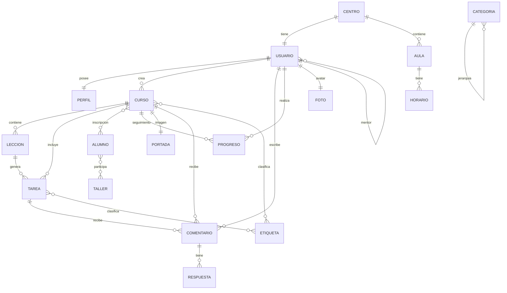

# 05. Mermaid y relaciones

## 1. Mermaid del proyecto

## 2. Cómo usar este Mermaid
Este diagrama es la base del curso. Cada relación debe convertirse en:
- tabla o tablas
- claves foráneas o tablas pivote
- métodos en modelos Eloquent
- ejemplos de consulta

## 3. Relaciones 1 a 1
### Usuario -> Perfil
Un usuario tiene un perfil ampliado.

### Usuario -> Foto
Un usuario tiene una foto principal.

## 4. Relaciones 1 a muchos
### Curso -> Leccion
Un curso tiene muchas lecciones.

### Leccion -> Tarea
Una lección tiene muchas tareas.

### Otros casos
- Usuario -> Curso
- Usuario -> Comentario
- Curso -> Comentario
- Tarea -> Comentario

## 5. Relaciones muchos a muchos
### Curso <-> Alumno
Un curso tiene muchos alumnos y un alumno puede estar en muchos cursos.

### Taller <-> Alumno
Un taller tiene muchos alumnos y un alumno puede estar en muchos talleres.

## 6. Relaciones hasManyThrough
### Curso -> Tarea a través de Leccion
Permite obtener las tareas de un curso a través de sus lecciones.

### Centro -> Tarea a través de Curso
También puedes practicar un acceso indirecto desde una entidad más alta.

## 7. Polimórficas 1 a 1
### Foto -> Usuario
### Foto -> Curso
Una misma tabla `fotos` puede guardar el avatar de usuario o la portada de curso.

## 8. Polimórficas 1 a muchos
### Comentario -> Curso
### Comentario -> Tarea
Una misma tabla `comentarios` sirve para comentar distintos tipos de contenido.

## 9. Polimórficas muchos a muchos
### Etiqueta <-> Curso
### Etiqueta <-> Tarea
Una misma etiqueta puede clasificar varios tipos de entidad.

## 10. Autorrelaciones
### Usuario -> Usuario
Un usuario puede ser mentor de otro.

### Categoria -> Categoria
Una categoría puede ser hija de otra.

## 11. Objetivo del examen
Si dominas este Mermaid, puedes construir:
- CRUD web
- API
- seeders
- tests
- ejemplos de consultas Eloquent
