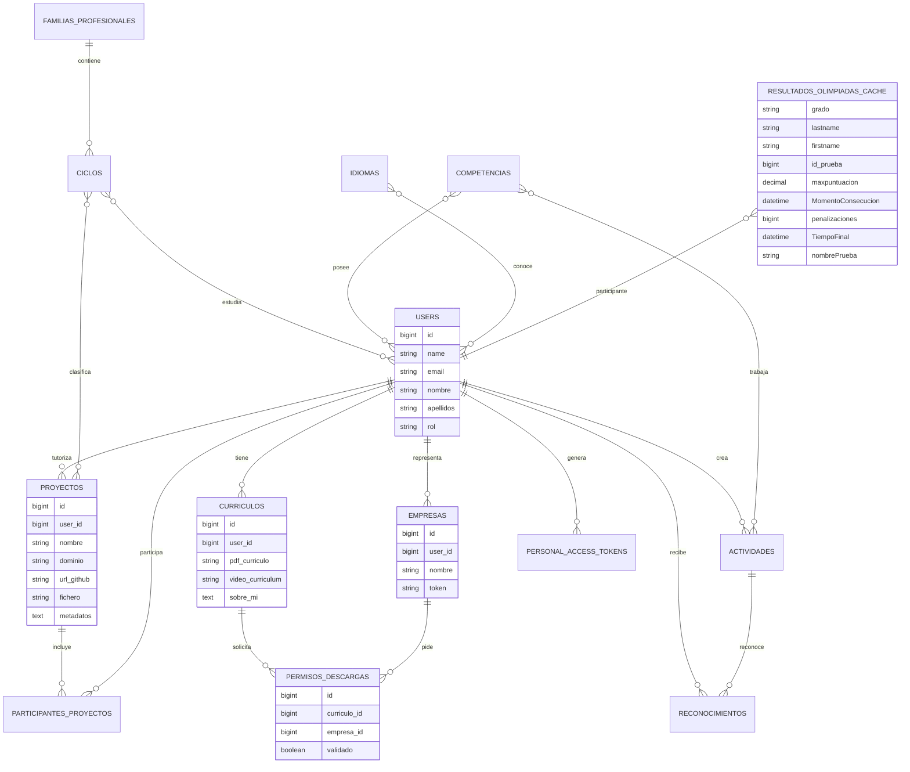
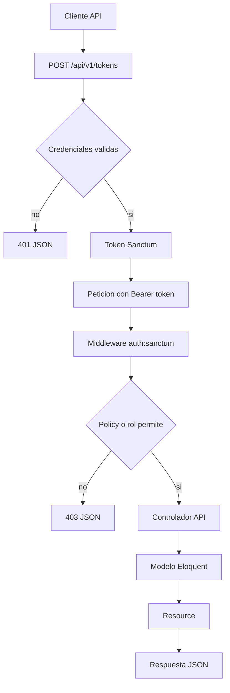
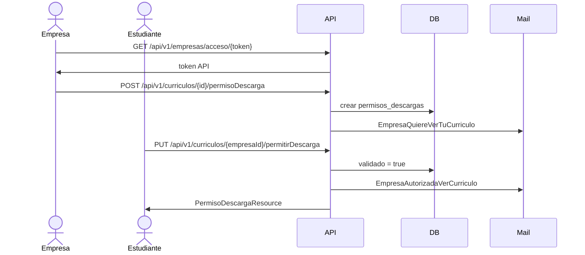
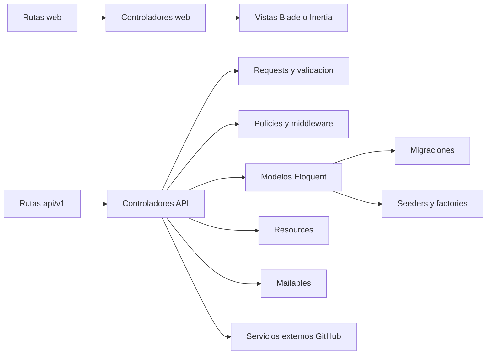

# Proyecto final - vision Mermaid

## Modelo de datos principal

```mermaid
erDiagram
    USERS ||--o{ PROYECTOS : tutoriza
    USERS ||--o{ CURRICULOS : tiene
    USERS ||--o{ ACTIVIDADES : crea
    USERS ||--o{ RECONOCIMIENTOS : recibe
    USERS ||--o{ EMPRESAS : representa
    USERS ||--o{ PERSONAL_ACCESS_TOKENS : genera

    FAMILIAS_PROFESIONALES ||--o{ CICLOS : contiene
    CICLOS }o--o{ USERS : estudia
    CICLOS }o--o{ PROYECTOS : clasifica

    COMPETENCIAS }o--o{ USERS : posee
    COMPETENCIAS }o--o{ ACTIVIDADES : trabaja
    IDIOMAS }o--o{ USERS : conoce

    ACTIVIDADES ||--o{ RECONOCIMIENTOS : reconoce
    CURRICULOS ||--o{ PERMISOS_DESCARGAS : solicita
    EMPRESAS ||--o{ PERMISOS_DESCARGAS : pide

    PROYECTOS ||--o{ PARTICIPANTES_PROYECTOS : incluye
    USERS ||--o{ PARTICIPANTES_PROYECTOS : participa

    RESULTADOS_OLIMPIADAS_CACHE }o--|| USERS : participante

    USERS {
        bigint id
        string name
        string email
        string nombre
        string apellidos
        string rol
    }

    PROYECTOS {
        bigint id
        bigint user_id
        string nombre
        string dominio
        string url_github
        string fichero
        text metadatos
    }

    CURRICULOS {
        bigint id
        bigint user_id
        string pdf_curriculo
        string video_curriculum
        text sobre_mi
    }

    EMPRESAS {
        bigint id
        bigint user_id
        string nombre
        string token
    }

    PERMISOS_DESCARGAS {
        bigint id
        bigint curriculo_id
        bigint empresa_id
        boolean validado
    }

    RESULTADOS_OLIMPIADAS_CACHE {
        string grado
        string lastname
        string firstname
        bigint id_prueba
        decimal maxpuntuacion
        datetime MomentoConsecucion
        bigint penalizaciones
        datetime TiempoFinal
        string nombrePrueba
    }
```

## Flujo de autenticacion y autorizacion API

```mermaid
flowchart TD
    A[Cliente API] --> B[POST /api/v1/tokens]
    B --> C{Credenciales validas}
    C -- no --> D[401 JSON]
    C -- si --> E[Token Sanctum]
    E --> F[Peticion con Bearer token]
    F --> G[Middleware auth:sanctum]
    G --> H{Policy o rol permite}
    H -- no --> I[403 JSON]
    H -- si --> J[Controlador API]
    J --> K[Modelo Eloquent]
    K --> L[Resource]
    L --> M[Respuesta JSON]
```

## Flujo de permiso de descarga

```mermaid
sequenceDiagram
    actor Empresa
    actor Estudiante
    participant API
    participant DB
    participant Mail

    Empresa->>API: GET /api/v1/empresas/acceso/{token}
    API->>Empresa: token API
    Empresa->>API: POST /api/v1/curriculos/{id}/permisoDescarga
    API->>DB: crear permisos_descargas
    API->>Mail: EmpresaQuiereVerTuCurriculo
    Estudiante->>API: PUT /api/v1/curriculos/{empresaId}/permitirDescarga
    API->>DB: validado = true
    API->>Mail: EmpresaAutorizadaVerCurriculo
    API->>Estudiante: PermisoDescargaResource
```

## Capas de la aplicacion

```mermaid
flowchart LR
    A[Rutas web] --> B[Controladores web]
    B --> C[Vistas Blade o Inertia]
    D[Rutas api/v1] --> E[Controladores API]
    E --> F[Requests y validacion]
    E --> G[Policies y middleware]
    E --> H[Modelos Eloquent]
    H --> I[Migraciones]
    H --> J[Seeders y factories]
    E --> K[Resources]
    E --> L[Mailables]
    E --> M[Servicios externos GitHub]
```
